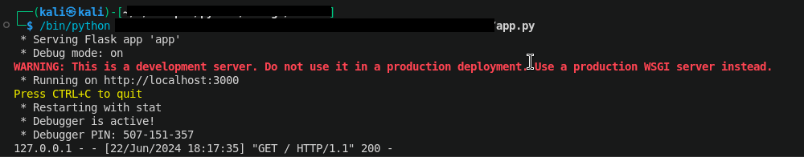
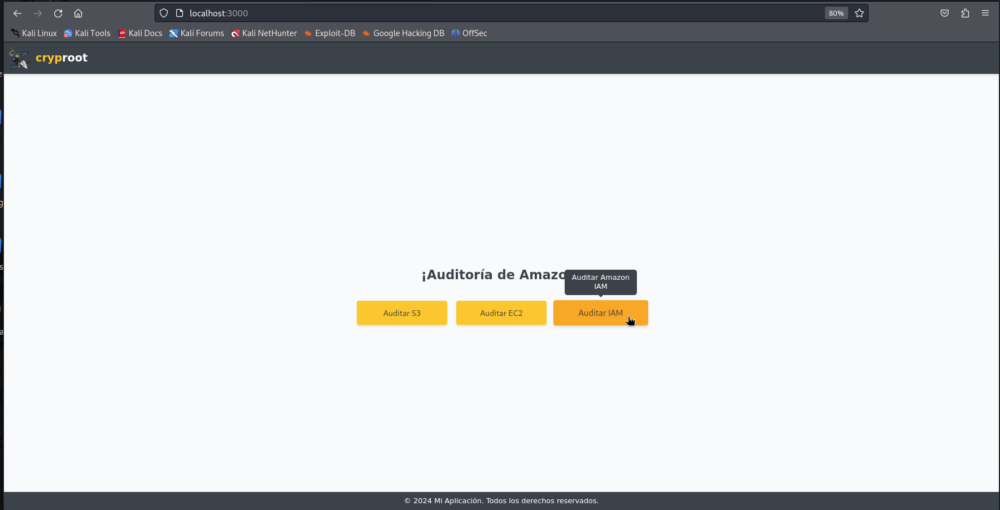
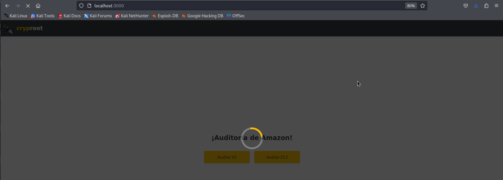
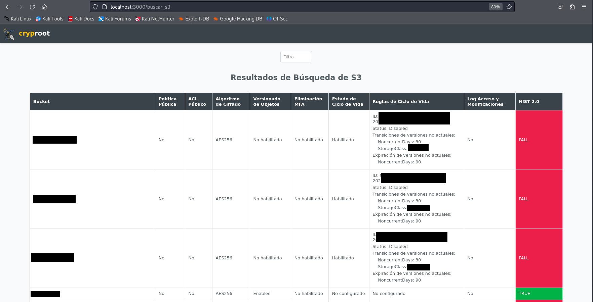

# CloudVigilant

Este proyecto es una herramienta web avanzada diseñada para auditar y explorar los resultados de diversos servicios en la nube de Amazon, como S3, EC2, y cuentas IAM, entre otros. Su objetivo es proporcionar a los usuarios una plataforma intuitiva y potente para gestionar y analizar sus recursos en la nube de manera eficiente.

## Características

- **Ordenación de Columnas:** Facilita la exploración de datos permitiendo ordenar los resultados al hacer clic en los encabezados de las columnas.

- **Visualización Detallada:** Muestra información detallada sobre cada bucket, incluyendo reglas de ciclo de vida si están configuradas.
  
- **Evaluación NIST 2.0:** Introduce una evaluación conforme a los estándares NIST 2.0 para cada servicio, indicando si cumple con requisitos específicos de cifrado, versionado de objetos y otros criterios clave de seguridad.


## Instalación
```python
pip install Flask
pip install boto3
git clone https://github.com/cryproot/S3-Audit-Results-Explore.git
aws configure (importante configurar tus credenciales aws cli)
```
## Iniciar Aplicación
Para iniciar la aplicación, ejecuta el siguiente comando en tu terminal:
```python
python3 app.py
```
Esto iniciará un servidor local y te proporcionará una URL. Abre esta URL en tu navegador web para comenzar a utilizar la aplicación.



Veamos un ejemplo auditando los buckets s3 de aws. Al abrir la URL http://localhost:3000, verás la siguiente interfaz:



Haz clic en el botón correspondiente para ejecutar la lógica del programa.



Actualmente, al pasar el cursor sobre las columnas, estas se sombrearán de color amarillo. Esto indica que puedes hacer clic para filtrar datos por columnas o utilizar el filtro avanzado por nombre de bucket S3 en la barra superior. Los resultados se mostrarán en pantalla.



