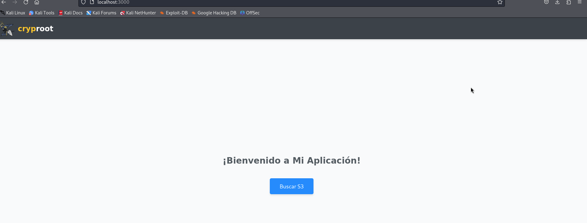
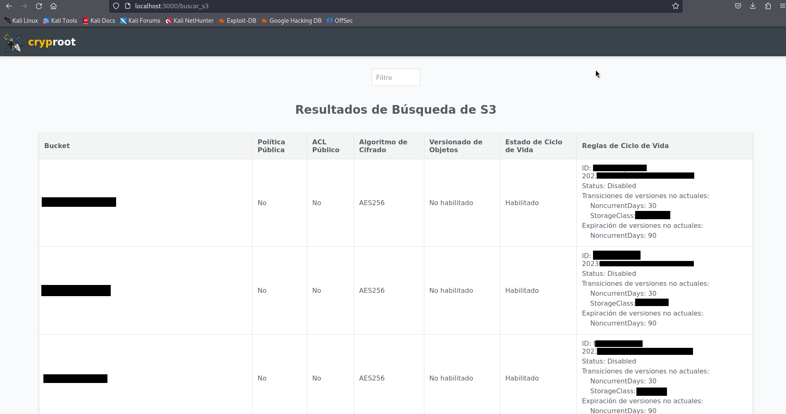

# S3 Audit Results Explorer

Este proyecto es una herramienta web diseñada para auditar y explorar los resultados de los buckets de Amazon S3. Permite a los usuarios filtrar, ordenar y visualizar información detallada sobre los buckets y sus configuraciones.

## Características

- **Filtrado Avanzado:** Permite filtrar los resultados por nombre de bucket, políticas públicas, ACL públicos, algoritmo de cifrado, estado de versionado de objetos y estado del ciclo de vida.
  
- **Ordenamiento de Columnas:** Facilita la exploración de datos al permitir ordenar los resultados haciendo clic en los encabezados de columna.

- **Visualización Detallada:** Muestra información detallada sobre cada bucket, incluyendo reglas de ciclo de vida, si están configuradas.

## Instalación
```python
pip install Flask
pip install boto3
```
## Iniciar Aplicación
Para iniciar la aplicación se debe de ejecutar el siguiente comando
```python
python3 app.py
```
El comando anterior proporcionará una URL a nivel localhost. Ábrela en tu navegador:


Al abrir la URL http://localhost:3000, verás la siguiente interfaz:



Haz clic en el botón correspondiente para ejecutar la lógica del programa. Los resultados se mostrarán en pantalla:



