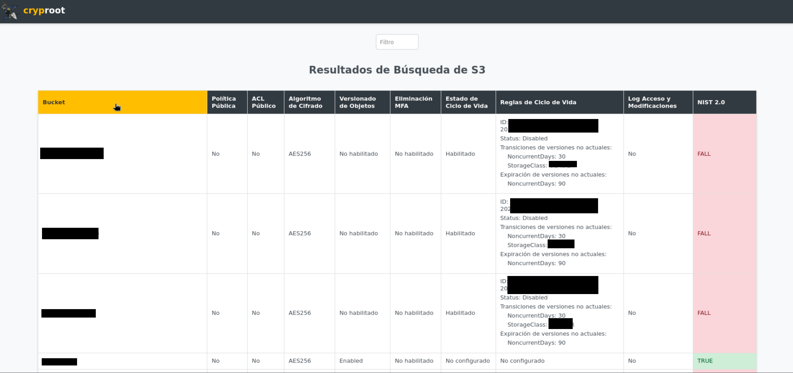

# CloudVigilant

This project is a web tool designed to audit and explore the results of Amazon cloud services such as S3 and EC2, among others. It provides users with the ability to filter, sort, and visualize detailed information efficiently.

## Características

- **Column Sorting:** Facilitates data exploration by allowing results to be sorted by clicking on column headers.

- **Detailed Visualization:** Displays detailed information about each bucket, including lifecycle rules if configured.

- **NIST 2.0 Assessment:** Introduces an assessment according to NIST 2.0 standards for each service, indicating whether it meets specific encryption and object versioning requirements and other things mains.


## Instalación
```python
pip install Flask
pip install boto3
git clone https://github.com/cryproot/S3-Audit-Results-Explore.git
aws configure
```
## Iniciar Aplicación
Para iniciar la aplicación, ejecuta el siguiente comando en tu terminal:
```python
python3 app.py
```
Esto iniciará un servidor local y te proporcionará una URL. Abre esta URL en tu navegador web para comenzar a utilizar la aplicación.


Al abrir la URL http://localhost:3000, verás la siguiente interfaz:


Haz clic en el botón correspondiente para ejecutar la lógica del programa.


Actualmente, al pasar el cursor sobre las columnas, estas se sombrearán de color amarillo. Esto indica que puedes hacer clic para filtrar datos por columnas o utilizar el filtro avanzado por nombre de bucket S3 en la barra superior. Los resultados se mostrarán en pantalla.



