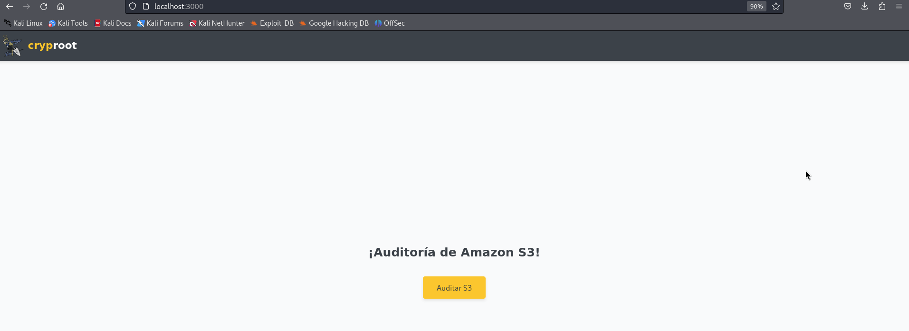
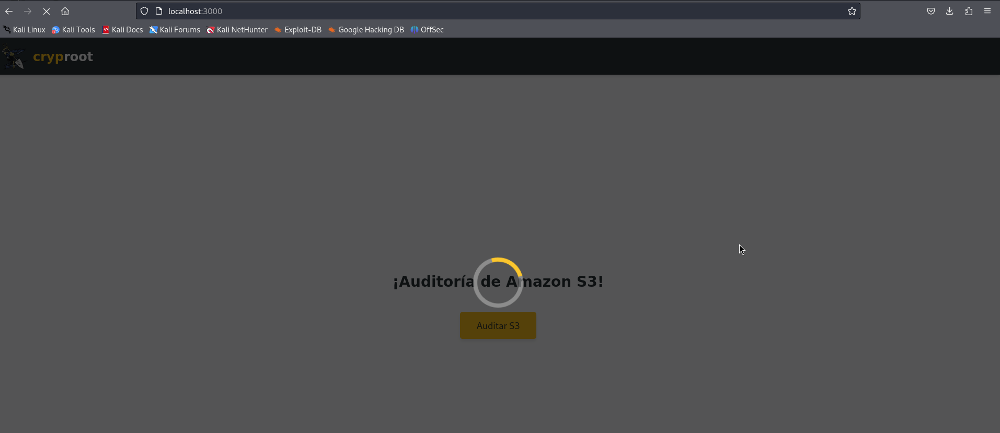
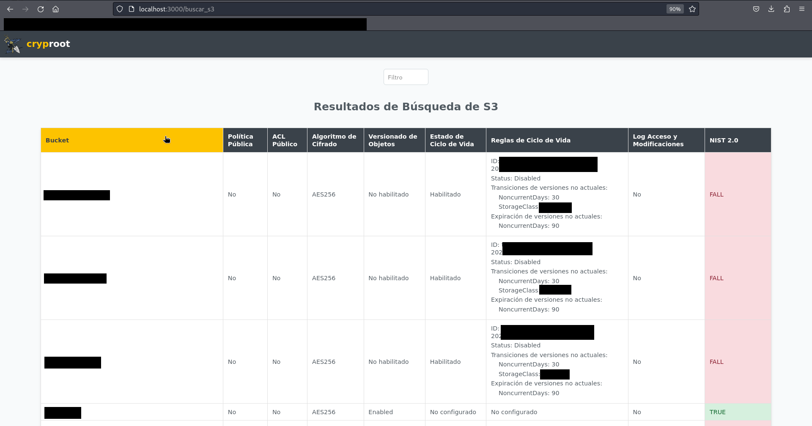

# S3 Audit Results Explorer

Este proyecto es una herramienta web diseñada para auditar y explorar los resultados de los buckets de Amazon S3. Permite a los usuarios filtrar, ordenar y visualizar información detallada sobre los buckets y sus configuraciones.

## Características

- **Filtrado Avanzado:** Permite filtrar los resultados por nombre de bucket, políticas públicas, ACL públicos, algoritmo de cifrado, estado de versionado de objetos y estado del ciclo de vida.

- **Ordenamiento de Columnas:** Facilita la exploración de datos al permitir ordenar los resultados haciendo clic en los encabezados de columna.

- **Visualización Detallada:** Muestra información detallada sobre cada bucket, incluyendo reglas de ciclo de vida, si están configuradas.

- **Evaluación NIST 2.0:** Introduce una evaluación según los estándares de NIST 2.0 para cada bucket, indicando si cumple con requisitos específicos de cifrado y versionado de objetos.

- **Logging de Acceso y Modificaciones:** Incluye una nueva funcionalidad para verificar el estado de logging de acceso y modificaciones en cada bucket. Esto es crucial para garantizar la trazabilidad y la seguridad de los datos almacenados en S3.


## Instalación
```python
pip install Flask
pip install boto3
git clone https://github.com/cryproot/S3-Audit-Results-Explore.git
aws configure
```
## Iniciar Aplicación
Para iniciar la aplicación, ejecuta el siguiente comando en tu terminal:
```python
python3 app.py
```
Esto iniciará un servidor local y te proporcionará una URL. Abre esta URL en tu navegador web para comenzar a utilizar la aplicación.


Al abrir la URL http://localhost:3000, verás la siguiente interfaz:



Haz clic en el botón correspondiente para ejecutar la lógica del programa.



Actualmente, al pasar el cursor sobre las columnas, estas se sombrearán de color amarillo. Esto indica que puedes hacer clic para filtrar datos por columnas o utilizar el filtro avanzado por nombre de bucket S3 en la barra superior. Los resultados se mostrarán en pantalla.



